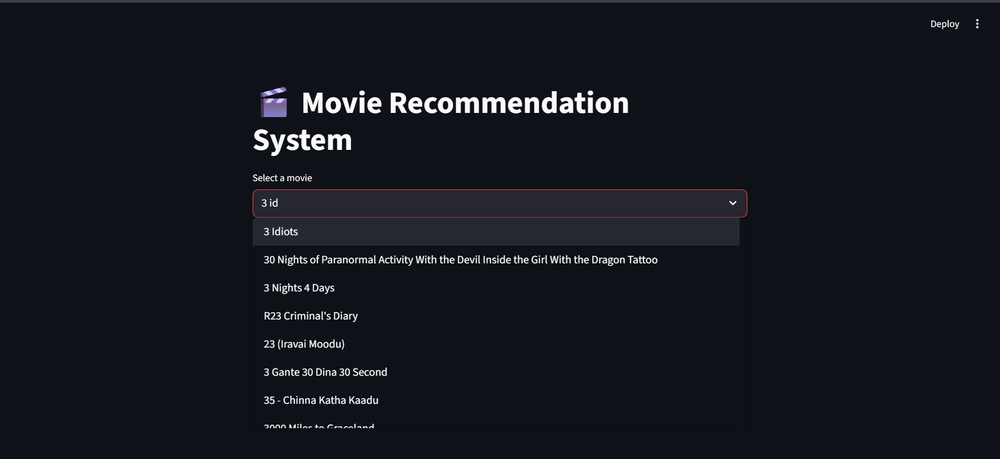
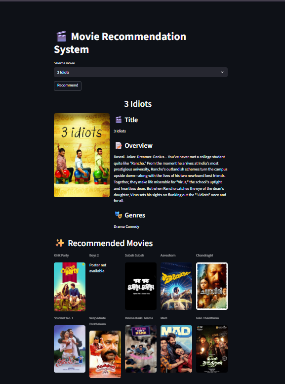
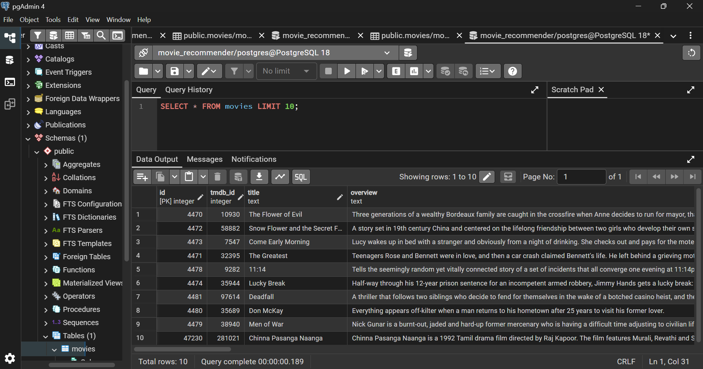

# Real-Time Movie Recommender System 🎬

## Project Overview

This project builds a production-style movie recommender system that automatically fetches newly released movies, processes their metadata, generates semantic embeddings, and stores them in a database for intelligent movie recommendations.

The system continuously updates its dataset using the API provided by The Movie Database, enabling the recommendation engine to stay up to date with the latest movie releases.

Unlike basic recommendation projects that use static datasets, this project simulates a real-world machine learning data pipeline that performs automated data ingestion, feature engineering, embedding generation, and database updates.

## Key Features

- Fetches latest movies from TMDB API
- Supports multiple Indian languages (Hindi, Tamil, Telugu, Kannada, Malayalam, Bengali, Marathi)
- Automatically updates movie dataset daily
- Fetches additional movie metadata (cast, director, keywords)
- Creates feature-rich movie tags for recommendation
- Generates semantic embeddings using transformer models
- Stores movie data in a PostgreSQL database
- Prevents duplicate movie insertion using conflict handling
- Uses multithreading for faster API data collection
- Uses bulk database insertion for high performance

## Tech Stack

### Programming

- Python
- Pandas

### Machine Learning

- SentenceTransformers

### Database

- PostgreSQL
- Psycopg2

### Data Pipeline

- TMDB API
- Multithreading (ThreadPoolExecutor)
- Scheduled automation

## System Architecture

TMDB API
   ↓
Fetch Movie Metadata
   ↓
Fetch Additional Details (Cast, Director, Keywords)
   ↓
Data Cleaning & Feature Engineering
   ↓
Tag Generation
   ↓
Semantic Embedding Creation
   ↓
PostgreSQL Database
   ↓
Recommendation Engine

## Recommendation Strategy

This system uses semantic similarity between movie embeddings to recommend movies with similar themes, cast, and genres.

Embeddings are generated using transformer-based sentence models from
SentenceTransformers.

These embeddings allow the system to capture contextual relationships between movies, improving recommendation quality compared to simple keyword matching.

## Installation

### Clone the repository

```bash
git clone https://github.com/yourusername/movie-recommender-system.git
```

### Navigate to the project folder
```bash
cd movie-recommender-system
```

### cd movie-recommender-system
```bash 
pip install -r requirements.txt
```

## Running the Data Pipeline

```bash 
python daily_movie_pipeline.py
```

## Automation

The data pipeline is scheduled to run automatically every day using Windows Task Scheduler, ensuring the recommendation dataset stays updated with new movie releases.

## Example Use Case

This system can be used to power:
- Movie recommendation websites
- OTT platform recommendation engines
- Personalized movie discovery tools

## Future Improvements

Possible enhancements for this system include:
- Vector search using FAISS
- PostgreSQL vector indexing using pgvector
- User-based collaborative filtering
- Real-time recommendation API
- Frontend movie recommendation interface
- Cloud deployment of the pipeline

## Example Output

### Drop Down


### Recommendations


### PostgreSql Database


## Project Motivation

Most beginner recommendation projects use static datasets such as MovieLens. This project was designed to simulate a real-world machine learning data pipeline, where data is continuously fetched, processed, and updated automatically.

The goal was to build a system closer to how recommendation systems operate in production environments.

## Author

### Prakruthi S B

Aspiring Machine Learning Engineer passionate about building scalable data-driven systems.

⭐ If you found this project useful, consider giving it a star.